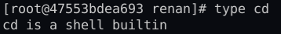
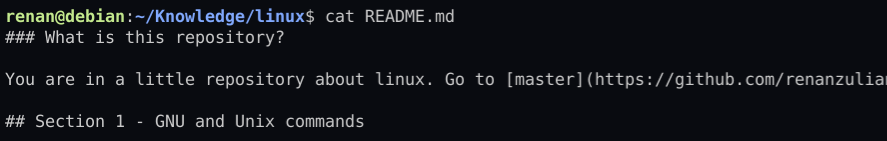

### What is this repository?

You are in a little repository about linux. Go to [master](https://github.com/renanzulian/linux) and let know what I'm doing here.

## Section 1 - GNU and Unix commands

### Working on Command line

The terminal is probabily the first things that peoples remember when the subject is Linux. The terminal is basicly an interface to execute commands on linux. The correct term of this interface is **shell**. All Linux Operational System provides some type of shell (usually is bash). You can find many types of shell like zsh, sh, csh and much more. Then you only need to keep on your mind that *we use the shell to execute our commands.*

#### Command types
On linux shell you can have two types of commands:

1. Internal command
    
    Is an own command of shell. On bash for example you can have `cd` command to change the working directory of shell. How do I know that `cd` is a own command of shell? Easy only use command the command `type`.
    
    

    try ever command that you know using `type [command]` and discover what type is your command!

2. External command

    This commands can be installed on your machine and they are independent of your shell. For example when you install vim you **will can** use the command `vim` to edit some text file. But you only will may use this command if your shell knows where the binary is. It means that independent of your external command you need to provide the **PATH** of them to your shell. The linux environment variable PATH is used to shell find where is your binaries. Let's find where is our vim binary:

    

    Very nice the command also is on hash (on memory) and our shell knows this command. It means the command is on PATH an we can check it using another good command `echo`.

    

    All directories are separated with by colon and whe can find the vim's directory **/usr/bin** on the path. Whether the directory isn't on path the shell would output "bash: vim: command not found".

    If you wanna execute some script or binary that isn't on your path you only need to type down it's absolute path or use `./[nome of the script/binary]` on folder that the content be.

#### Descriptors (Standards inputs and outputs)

Many linux commands needs some inputs and can outputs some result or an error. For example the `cat` command needs some text file to show the file content(result). If no text file has been provided to command an error will appears on your screen. Let's check it out.

Here we have the input **README.md** to the command `cat`. Our output is all content under the command.

Here we have another input and our output is an error.

There are three standards of commands: **stdin**, **stdout** and **stderr**. It can be useful to combinate some commands. For example we can use the result of some command to input to another or to get the erros of some command to write in some file like a log. Let's check it out.

We use the result of `cat` command filter the lines that have 'text' string with the `grep` command.

Where is our output?! I used the `ls` command but has nothing on my screen (the standard output of linux). 

Here was our results and errors!!
I used the `|`, `1>` and `2>` to handle the inputs and outputs. See below some examples of these commands.

- `|`

    *Syntax*: `{command1} | {command2}`
    
    *Description*: The output of the first command (command1) will be the input of the last command (command2). You can use it whener you want. Example: `{command1} | {command2} ... | {commandN} `

- `>`

    *Syntax*: `{command1} > file.txt`

    *Description*: The output (result) of the command1 will create or replace a new file (file.txt) writed the results of command1.

- `>>`
- `1>`
- `2>`
- `<`

shell bash

echo

three types of commands

interno(do bash) externos(in path) externo(not in path)

pwd

ls

cd

abosolute path and relative path

path